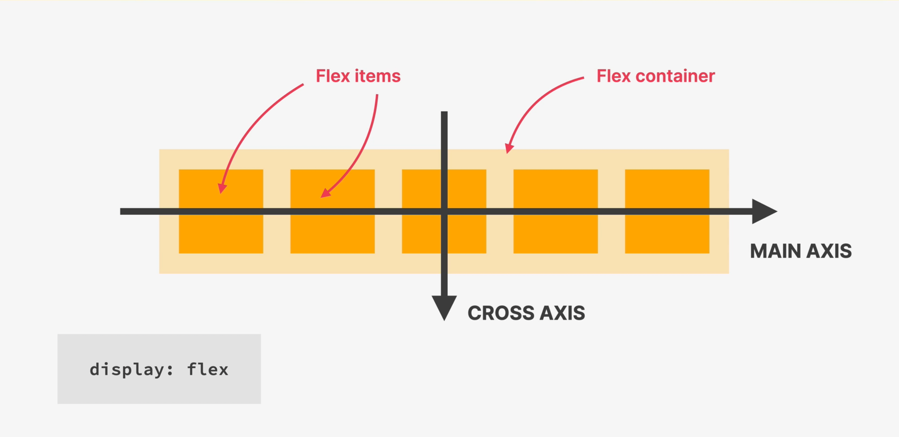

# CSS

- It stands for Cascading Style Sheets.
- It is used to style web pages.
- CSS describes the visual style and presentation of the content written in HTML.
- CSS consists of countless properties that developers use to fermat the content: properties about font, text, spacing, layout, color, etc.

```css
/* Syntax of selector */
/*
  {} is the declaration block.
*/
<selector > {
  /* Property: value */
  property: value; /* This is a declaration style. */
}

/*
  selector + declaration block is known as CSS rule.
*/

/*
  - For HTML tags, selector is the tag name.
    <div>This is a div</div>
    div {

    }

  - For CSS classes, selector is the class name.
    <div class="my-class">This is a div</div>
    .my-class {

    }

  - For IDs, selector is the ID name.
    <div id="my-id">This is a div</div>
    #my-id {

    }
*/
```

- CSS can be written in three ways:

  - Inline:

    - Inline CSS is written inside the HTML tag.
    - CSS written inside the tag is representable for that tag only.
    - Don't write inline css in the HTML file, not a good practice as it is hard to maintain.

    ```html
    <!-- Syntax -->
    <div class="my-class" style="css style goes here">This is a div</div>
    ```

  - Internal:

    - Internal CSS is written inside style tag within the web page.

    ```html
    <!-- Syntax -->
    <head>
      <style>
        .my-class {
          /* CSS style goes here */
        }
      </style>
    </head>

    <div class="my-class">This is a div</div>
    ```

  - External:

    - External CSS is written in a separate file.
    - Most preferred way of writing CSS as we can have same CSS in multiple files.
    - Same as internal style, but written in separate file.
    - You can have multiple css files with a page and its precedence is increases as we move downward.

    ```html
    <!-- Syntax -->
    <head>
      <link rel="stylesheet" href="link related external css file" />
    </head>
    ```

- Selectors:

  - Selector is a way to select a particular element.
  - Type of selector:

    1. Tag: div
    2. Class: .my-class
    3. ID: #my-id
    4. Descendant: div .my-class | div.my-class
    5. Child: div > div
    6. Adjacent sibling:

    - Next sibling of an element
    - div + div

    7. General sibling: div ~ div
    8. Attribute: div[attribute]
    9. Pseudo-class: div:pseudo-class
    10. Pseudo-element:

    - These are the elements that really don't exist in actual HTML but we can still select and style it in css.
    - It is an inline element.
    - div::pseudo-element
    - Eg: first-letter, before, after

    11. Combined:

    - If two or more elements have same css style than we can combine them using comma and apply css style to them.

      ```html
      <style>
        h1,
        .my-class,
        #my-id {
          /* CSS style goes here */
        }
      </style>

      <h1>This is H1</h1>
      <div class="my-class">This is a div</div>
      <div id="my-id">This is a div</div>
      ```

- Color:

  - RGB Model:

    - Every color can be represented by a combination of RED, GREEN and BLUE.
    - Each color has a value between 0 and 255.
    - This leads to a total of 256^3 = 16,777,216 different colors.
    - rgb(255, 255, 0) is a color with RED value 255, GREEN value 255 and BLUE value 0.

  - RGBA Model:

    - Every color can be represented by a combination of RED, GREEN, BLUE and ALPHA.
    - rgba(255, 0, 0, 0.5) is a color with RED value 255, GREEN value 0 and BLUE value 0 and opacity value 0.5.
    - `most used when we want to make a transparent color.`

  - Hexadecimal Model:

    - Instead of using a scale from 0 to 255, we can use a scale from 0 to ff.
    - This is a shorter way of writing RGB model.
    - #ff0000 is a color with RED value ff and GREEN value 00 and BLUE value 00.
    - #ff000080 is a color with RED value ff and GREEN value 00 and BLUE value 00 and opacity value 80.
    - `most used to represent certain color.`

  ```css
  /* Syntax */
  color: rgb(255, 255, 0);
  color: rgba(255, 255, 0, 0.5);
  color: #ff0000;
  ```

## Styling

### Text

```css
/* Most common */
- font-size: string | number; /* manipulates the size of text */
- font-family: string; /* manipulates the font family i.e font writing style */
- font-weight: string; /* manipulates the font weight i.e bold, normal, etc */
- font-style: italic | bold | normal; /* manipulates the font style */
- text-align: left | right | center | justify; /* manipulates the text alignment */
- text-decoration: underline | line-through | none; /* manipulates the text decoration */
- text-transform: capitalize | lowercase | uppercase; /* manipulates the text transform */
- letter-spacing: string | number; /* manipulates the letter spacing */
- line-height: string | number; /* manipulates the line height */

/* Least common */
- word-spacing: string | number; /* manipulates the word spacing */
- color: string; /* manipulates the text color */
- white-space: nowrap | normal | pre | pre-line | pre-wrap; /* manipulates the white space */
- word-wrap: break-word | normal; /* manipulates the word wrap */
- text-indent: string | number; /* manipulates the text indent */
- text-shadow: string; /* manipulates the text shadow */
- text-overflow: ellipsis | clip | hidden | visible; /* manipulates the text overflow */
```

### Box

```css
height: string | number; /* manipulates the height */
width: string | number; /* manipulates the width */
```

```css
padding: string | number; /* manipulates the padding */
padding-top: string | number; /* manipulates the padding top */
padding-right: string | number; /* manipulates the padding right */
padding-bottom: string | number; /* manipulates the padding bottom */
padding-left: string | number; /* manipulates the padding left */
```

```css
margin: string | number; /* manipulates the margin */
margin-top: string | number; /* manipulates the margin top */
margin-right: string | number; /* manipulates the margin right */
margin-bottom: string | number; /* manipulates the margin bottom */
margin-left: string | number; /* manipulates the margin left */
```

```css

/* Most common */
- border: string; /* manipulates the border */
- border-radius: string | number; /* manipulates the border radius */

/* Least common */
- border-top: string; /* manipulates the border top */
- border-right: string; /* manipulates the border right */
- border-bottom: string; /* manipulates the border bottom */
- border-left: string; /* manipulates the border left */

- border-top-radius: string | number; /* manipulates the border top radius */
- border-right-radius: string | number; /* manipulates the border right radius */
- border-bottom-radius: string | number; /* manipulates the border bottom radius */
- border-left-radius: string | number; /* manipulates the border left radius */
- border-top-right-radius: string | number; /* manipulates the border top right radius */
- border-top-left-radius: string | number; /* manipulates the border top left radius */
- border-bottom-right-radius: string | number; /* manipulates the border bottom right radius */
- border-bottom-left-radius: string | number; /* manipulates the border bottom left radius */

- border-width: string | number; /* manipulates the border width */
- border-style: solid | dashed | dotted | double | groove | ridge | inset | outset; /* manipulates the border style */
- border-color: string; /* manipulates the border color */
- border-collapse: collapse | separate; /* manipulates the border collapse */
- border-spacing: string | number; /* manipulates the border spacing */
```

### Links

```css
a {
  /* manipulates overall property of link */
}
a:link {
  /* manipulates the link */
}
a:visited {
  /* manipulates the visited link */
}
a:hover {
  /* manipulates the hover link */
}
a:active {
  /* manipulates the active link */
}

/* Styling of the link should always be done in this order */
```

## CSS Theory

- Conflicts Between Selectors

  - When there are more that one selectors that are conflicting to same style of an element, then it's hierarchy and precedence will be followed.
  - Precedence of selectors or styles is:
    - `!important` > `inline` > `id (#)` > `class (.)` or `pseudo-class (:)` > `tag` > `universal (*)`
    - Never use `!important` while styling. This is just a hack to override the style which should never use.
  - Hierarchy of selectors is:
    - If more than one selectors that are conflicting to same style of an element, then it's hierarchy will be followed.
    - Usually style defined by last css class in style file will be used.

- Inheritance

  - Inheritance is a mechanism that allows style to be inherited from parent element.
  - Not all properties can be inherited.
  - Style related to text, spacing are inherited from parent element.

- Universal Selector

  - Universal selector is a selector that can be used to select all elements.
  - Style defined in universal selector will be applied to all elements.

- The CSS Box Model

  - It defined how elements are displayed in the screen and how they are sized.
  - In this model each element is seen as a box and that box consists of content, border and spaces inside (padding) and outside (margin) of the box.

  

  fig: Box Model

  

  fig: Calculation of height and width of the box model by default

  - Type of boxes:

    - Block-level

      - Occupies all **100% of the parent element's width**.
      - Will be **stacked vertically** by default, one after another.
      - Box-model applies as showed.

      ```css
      /* Syntax */
      display: block;
      ```

    - Inline

      - Occupies only the space **necessary for its content**.
      - Causes **no line-breaks** after or before the element.
      - **Heights and widths do not apply**.
      - **Paddings and margins** are applied **only horizontally** (left and right).

      ```css
      /* Syntax */
      display: inline;
      ```

    - Inline-block

      - Looks like inline from **outside**, behaves like block-level on the **inside**.
      - Occupies only content's space.
      - Causes no line-breaks.
      - Box-model applies as showed.
      - It is generally used in a place where we want to behave an inline element to behave like a block level element without completely loosing its properties.

      ```css
      /* Syntax */
      display: inline-block;
      ```

    - Positioning mode:

      - Determines how the flowed in the screen.
      - Types of mode:

        - **Normal Flow**

          - Default positioning.
          - Element is "in flow".
          - Elements are simply laid out according to their order in the HTML code.

          ```css
          /* Syntax */
          position: relative;
          ```

        - **Absolute Positioning**

          - Element is removed from the normal flow: "out of flow"
          - No impact on surrounding elements, might overlap them
          - We use top, bottom, left or right to offset the element from its relatively positioned container.

          ```css
          /* Syntax */
          position: absolute;
          ```

        - **Float Positioning**

          - Element is removed from the normal flow: "out of flow".
          - Text and inline elements will wrap around the floated element.
          - The container will not adjust its height to the element.

          ```css
          /* Syntax */
          float: left | right;
          ```

          - Sometimes float gives us problem as it floats the element out from its parent element.
            - If all child elements are floated than its parent element won't occupy its children container. This will give problem.
            - To fix this problem, we have to clear the float.
            ```css
            .clearfix::after {
              content: "";
              display: block;
              clear: both;
            }
            ```

        

## Layout

- Layout is the way text, images and other content is placed and arranged on a webpage.
- Layout gives the page a visual structure, into which we place our content.
- **Building a layout** is arranging page elements into a visual structure, instead of simply having them placed one after another.
- Why layout is important?
  - Layout makes our site easy to understand and visually pleasing.
- Types of layout?

  - Component Layout
  - Page Layout

  
  fig: Types of Layout

- Ways to build the layout:

  - Float
  - Flex box
  - CSS Grid

  
  fig: Ways to build layout

### Float

- Element is removed from the normal flow: "out of flow".
- Text and inline elements will wrap around the floated element.
- The container will not adjust its height to the element.

```css
/* Syntax */
float: left | right;
```

### Flex box

- Flexbox is a set of related **CSS properties** for **building 1-D layouts**.
- THe main idea behind flexbox is that empty space inside a container element can be **automatically divided** by its child elements.
- Flexbox makes it easy to automatically **align items to one another** inside a parent container, both horizontally and vertically.
- Flexbox solves common problems such as **vertical centering** and creating **equal-height columns**.
- Flexbox is perfect for **replacing floats**, allowing us to write fewer and cleaner HTML and CSS code.


fig: Flexbox Terminology

- We generally don't give width of the flex item, the width is calculated automatically by the browser based on flex-grow, flex-shrink and flex-basic properties.
- Similar goes for margin and padding.

```css
  /* For Flex Container */

  - gap: 0 | <string>; /* create space between items, without using margin */
  /*
    - determines how the content of the flex box should be placed vertically (i.e main axis).
    - In all other align-items value except for stretch, the flex box children occupies its respective content height, not the highest hight.
    - In align-items value for stretch, all the flex box children occupies same height i.e. the highest height.
  */
  - align-items: baseline | center | flex-start | flex-end | stretch (default);
  - justify-content: flex-start (default) | flex-end | center | space-around | space-between | space-evenly; /* determines how the content of the flex box should be placed horizontally (i.e. cross axis). */
  - flex-direction: row (default) | row-reverse | column | column-reverse; /* define which is the main axis */
  - flex-wrap: nowrap (default) | wrap | wrap-reverse; /* allow items to wrap into a new line if they are too large */
  - align-content: stretch (default) | flex-start | flex-end | center | space-between | space-around; /* applies when there are multiple lines i.e when flex-wrap: wrap */
```

```css
/* For Flex items */

- align-self: auto (default) | stretch | flex-start | flex-end | center | baseline; /* overwrite align-items for individual flex items */

/*
  - allow an element to grow (0 means no, 1+ means yes)
  - by "grow" it means to fill up the available free space in the container.
  - flex-grow: 2 means that element will get maximum width of its content's width + 2 * available free space.
*/
- flex-grow: 0 | <int>;
/*
  - allow an element to shrink (0 means no, 1+ means yes)
  - by shrink it means if there is no available space to fit all the elements in the container than it will shrink the width of an element by the browser automatically
*/
- flex-shrink: 1 | <int>;
/*
  - define an item's width, instead of the width property.
  - doesn't guarantee that the element will get the given width.
*/
- flex-basis: auto | <length>;
- flex: 0 1 auto | <int> <int> <string>; /* recommended shorthand for flex-grow, flex-shrink and flex-basis */
- order: 0 | <int>; /* controls order of items. -1 makes item first, as value increases the items are shifted to right */
```
