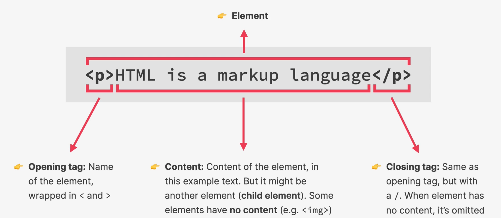

# HTML

- It is stands for HyperText Markup Language.
- It is used to create web pages.
- It is a markup language that web developers use to structure and describe the content of a web page.
- It consists of elements that describe different types of content:
  - paragraphs, links, headings, images, video, etc.
- Web browsers read HTML code and render it on the screen.

## HTML Elements

- An element has an opening tag and a closing tag.

  

  fig: HTML element

- In terms of defining and organizing content, there are two types of elements:
  - Elements used to define content.
    - Eg: headings, paragraphs, lists, images, etc.
  - Elements used to organize content.
    - Eg: sections, tables, etc.
- In terms of occupying space, there are two types of elements by default:
  - Block:
    - These types of element occupies whole width of its parent container.
    - Eg: div, paragraphs, headings, lists, etc.
  - Inline
    - These types of element occupies space of its text content.
    - Eg: links, bold, italics, em, strong, span, etc.
    - We generally don't nest block element inside inline element.
- Based on closing tag, element is of two types:
  - Self-closing:
    - These elements don't have closing tag.
    - Eg: img, br, hr, etc.
  - Closing:
    - These elements have closing tag.
    - Eg: div, p, h1, h2, h3, h4, h5, h6, etc.

## HTML Attributes

- An attribute is a name-value pair that is placed inside the opening tag of an element.
- It us used to give the browser extra information about that element.


fig: Element Attribute

## Nesting Elements

- HTML tags can be nested into other.

```html
<!-- 
  Example:
    - 'a' tag is nested inside 'span' tag. [span is parent of a]
    - 'span' tag is nested inside 'p' tag. [p is parent of span]
    - 'p' tag is nested inside 'div' tag. [div is parent of p]
-->
<div>
  <p>
    A moonbase opens up
    <span>multiple important <a href="#">economic avenues</a></span>
  </p>
</div>
```

- While nesting we cannot close the parent tag if its nested tag is not closed.

```html
<!-- Fix the mistakes -->
<h3>A unique place
<strong><p>We will lean about living in <em>microgravity</em>, surviving away from owr own planet, <em>and more </strong></em>, all while staying close enough to Earth for <strong>easy communication and assistance if needed.</p></strong>
```

## HTML tags

- **DOCTYPE**:

  - It is used to define the type of document.
  - It is used to define the version of document.
  - Its sole purpose is to prevent a browser from switching into so-called "[quirks mode](https://developer.mozilla.org/en-US/docs/Web/HTML/Quirks_Mode_and_Standards_Mode)" when rendering a document.
  - It is required to be the first tag in the document.
  - It ensures that the browser makes a best-effort attempt at following the relevant specifications.
  - When omitted it, browsers tend to use a different rendering mode that is incompatible with some specifications

  ```html
  <!-- Example -->

  <!-- This tells browser that given HTML is v5 -->
  <!DOCTYPE html>
  <html></html>
  ```

- **HTML**:

  - It is used to define the root element of the document.
  - It is used to define the language of document.

- **HEAD**:

  - It is used to define the title of document.
  - It is used to define the meta data of document.

- **META**:

  - It is used to define the meta data of document.

- **TITLE**:

  - It is used to define the title of document.

- **LINK**:

  - It is used to define the link of document.

- **BODY**:

  - It is used to define the content of web page.

- **HEADING**:

  - It is used to define document structure
  - Think of them like a table of contents
  - It is the hierarchical structure of the document.
  - There are 6 types of headings:
    - `h1`:
      - One per page
    - `h2`:
      - One per section
    - `h3`:
      - One per subsection
    - `h4`:
      - One per subparagraph
    - `h5`:
      - One per subparagraph
    - `h6`:
      - One per subparagraph

- **PARAGRAPH**:
- **LIST**:
- **IMAGE**:
- **SECTION**:
- **TABLE**:
- **Lists**:

  - There are two type of lists:
    - `ul`:
    - `ol`:
  - To define children of a list, use `li` tag.

- **Images**:

  - It is used to define images

- **Strong**:

- **Emphasize**:

- **Link**:

- **Image**:

- **Div**:

## Document Structure

```html
<!--  -->
<!DOCTYPE html>
<html lang="en">
  <!--
    - Head tag contains the metadata of a site.
    - The information present in the meta tag is for the browser.
    - The content of head tag is not displayed on the page.
   -->
  <head>
    <meta charset="UTF-8" />
    <meta name="viewport" content="width=device-width, initial-scale=1.0" />
    <title>Page Title</title>
  </head>
  <!-- 
    - Body tag contains the content of the page.
   -->
  <body>
    <h1>Hello, world!</h1>
  </body>
</html>
```

## Structuring Page Tags:

- These are the tags that are used to structure the page where each tag has its own semantic meaning.
- These are HTML 5 elements:
  - Header
  - Nav
  - Main
  - Section
  - Article
  - Footer
  - Aside
  - Figure
  - FigureCaption
  - FigureGroup
  - FigureRow
  - FigureRowGroup
  - FigureCol
  - FigureColGroup
  - FigureCaption

## Semantics

- Certain elements have a meaning attached to it.
- Semantic elements have certain element attached to it.
- Not all the html elements have a meaning attached to it.
  - Eg: `div`, `b`, `i`

### Why learning about semantics are important?

- SEO
- Accessibility
- Performance
- Usability
