# Design

## Why design is important?

| Good Design                                                                                                                  | Bad Design                                                                       |
| ---------------------------------------------------------------------------------------------------------------------------- | -------------------------------------------------------------------------------- |
| Creates an immediate and lasting **good impression** of the brand or product                                                 | Makes users believe the brand doesn't really care about their product or service |
| Makes the user **trust** the brand right away                                                                                | Makes the user insecure about trusting the brand                                 |
| Increases the user's **perceived value** of the brand or product                                                             | Makes the brand or product seem "cheap"                                          |
| Gives users exactly **what they were looking for** when coming to the site, e.g. purchasing a product or finding information | Leaves users confused, and makes it hard to for them to reach their goal         |

## Anyone can learn good design.

- Good web design is not subjective or creative.
- Everyone can learn basics by following a framework/system.

### Web design **INGREDIENTS**

- There are 10 different **ingredients** in **web design**
  1. Typography
  2. Colors
  3. Images/Illustrations
  4. Icons
  5. Shadows
  6. Border-radius
  7. Whitespace
  8. Visual Hierarchy
  9. User Experience
  10. Components/Layout

`NOTE: Design decisions for each ingredient are based on website personality.`

#### **Typography**

- Typography is the art and technique of arranging type to make written language **legible**, **readable** and **appealing** when displayed.
- Typography is all about making text beautiful and easy to read.

##### SERIF And SANS-SERIF Typefaces

| Serif Typeface                                                               | Sans-Serif Typeface                                                               |
| ---------------------------------------------------------------------------- | --------------------------------------------------------------------------------- |
| 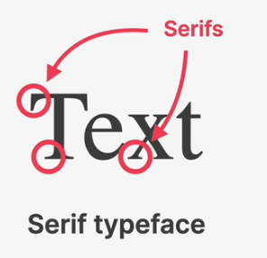 | 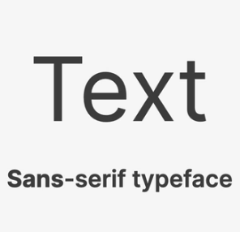 |
| Creates a traditional/classic look and feel                                  | Modern look and feel                                                              |
| Conveys trustworthiness                                                      | Clean and simple                                                                  |
| Good for long text                                                           | **Easier to choose for beginner designer**                                        |

#### How to get good typography

`Typefaces`

1. Always use good and popular typefaces and play it safe.

| Sans Serif Font                                                | Serif Font                                           |
| -------------------------------------------------------------- | ---------------------------------------------------- |
| 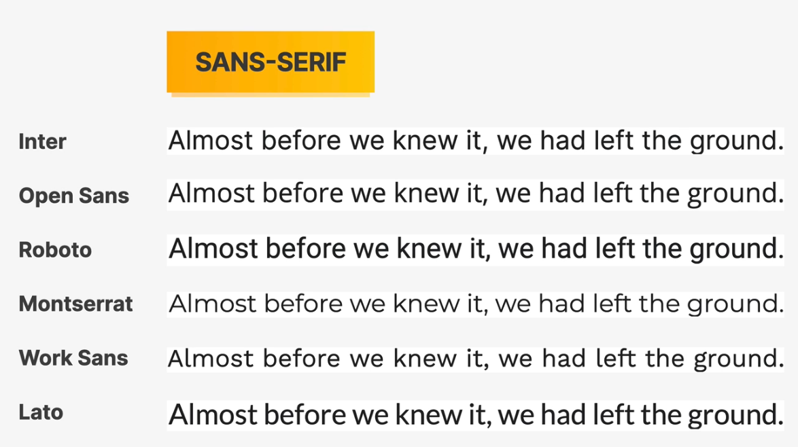 | 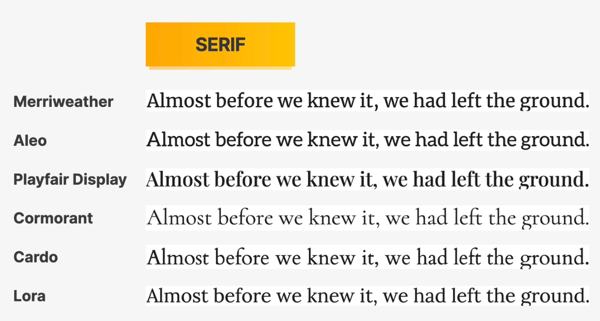 |

2. It's okay to use just one typeface per page. If you want more limit to 2 typefaces.
3. Choose the **right typeface** according to your website personality: 
   a. Choose the right personality for website  
   b. Decide between a serif and sans-serif typeface  
   c. Experiment with all the "good" typefaces to see which ones best fits your website's message  
   d. You can keep trying different typefaces as we design and build the page.  

`Font size and font weight`

4. When choosing font-sizes, **limit choices** to make life easier. Use a **"type scale" tool** or other **per-defined range**.
5. Use font size between 16px and 32px for **"normal" font**.
6. For **long text** (like blog post), try a size of 20px or even bigger.
7. For **headlines**, you can go really big (50px+) and bold (600+), **depending on personality**.
8. For any text, don't use a font weight under 400 (regular)
<figure>
  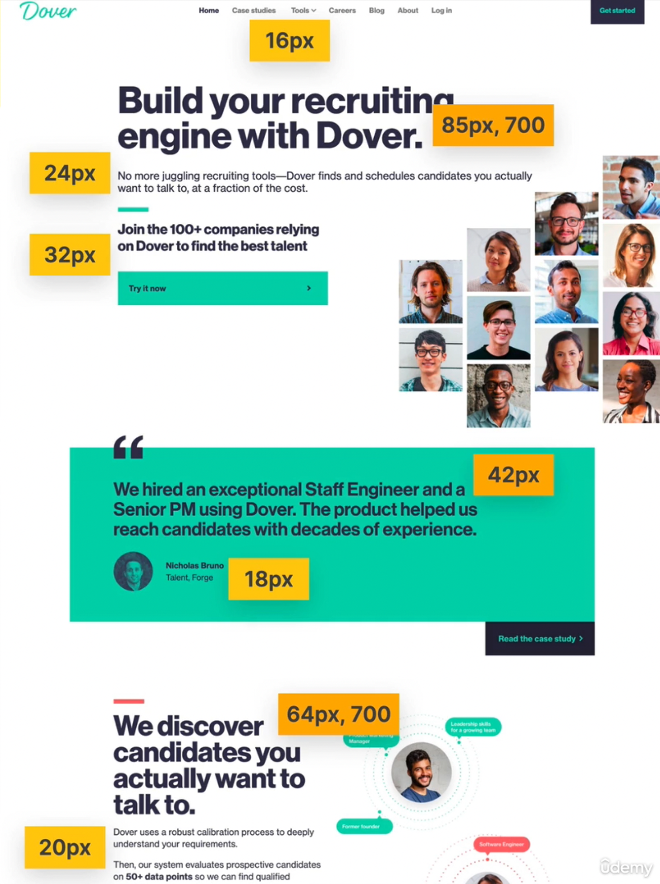
  <figcaption>Font Size</figcaption>
</figure>

`Reading Experience`

9. Use less than 75 characters per line.
<figure>
  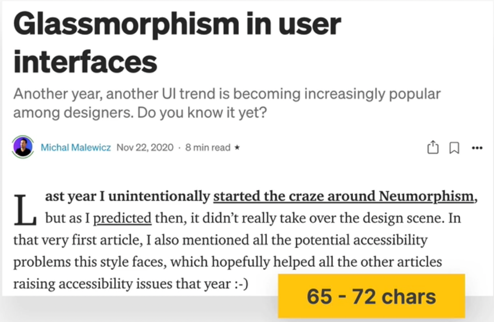
  <figcaption>Character Per Line For Readability Purpose</figcaption>
</figure>

10. For normal-sized text, use a line height between 1.5 and 2. For big text, go below 1.5.
<figure>
  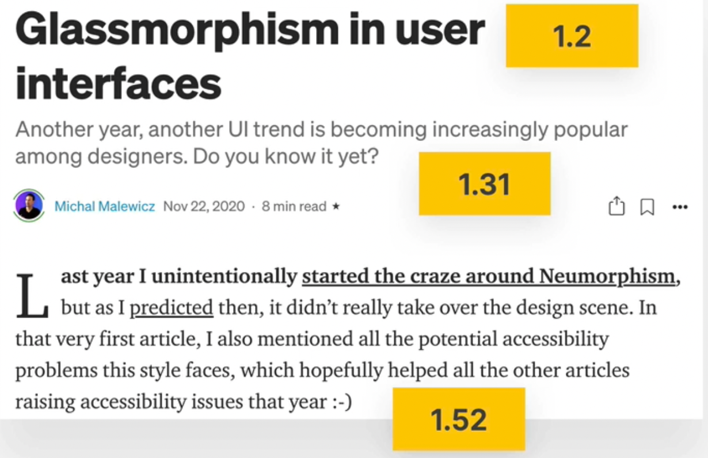
  <figcaption>Line Height For Readability Purpose</figcaption>
</figure>

- `NOTE: The smaller or longer the text, the larger the line height needs to be`

11. Decrease letter spacing in headlines, if it looks unnatural.
12. Experiment with all caps for short titles. Make them small and bold and decrease letter-spacing
<figure>
  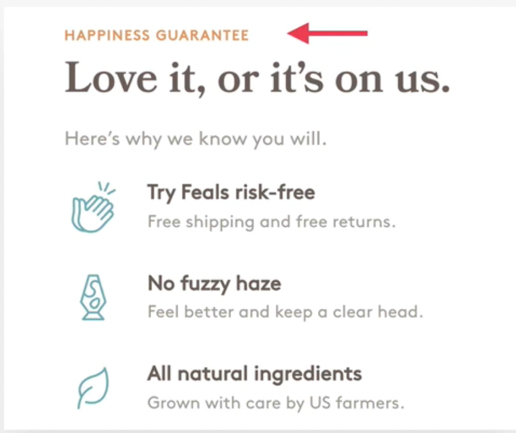
  <figcaption>Short Title Readability</figcaption>
</figure>

13. Usually, don't justify text.
<figure>
  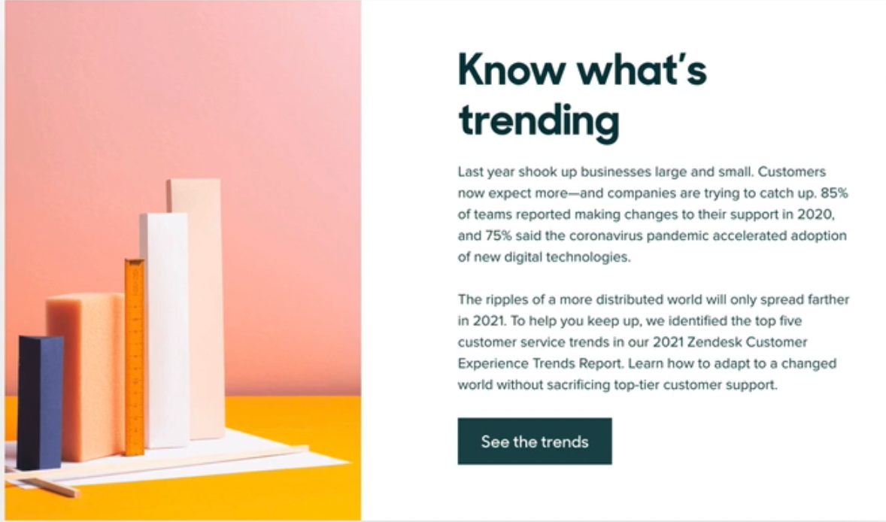
  <figcaption>Test Justification For Readability Purpose</figcaption>
</figure>

14. Don't center long text blocks unless these blocks are small.

#### **Color**

`Choosing Colors`

1. Make the main color **match your website's personality**: colors convey meaning!

- **Red** draws a ;pt pf attention, and symbolizes power, passion, and excitement.
- **Orange** is less aggressive, and conveys happiness, cheerfulness, and creativity.
- **Yellow** means joy, brightness, and intelligence
- **Greens** represents harmony, nature, growth, and health.
- **Blue** is associated with peace, trustworthiness, and professionalism.
- **Purple** conveys wealth, wisdom, and magic.
- **Pink** represents romance, care, and affection.
- **Brown** is associated with nature, durability and comfort.
- **Black** symbolizes power, elegance and minimalism, but also grief and sorrow.

2. Use a good color tone! Don’t choose a random tone or CSS named colors.

- `Tools used`: **open color**, **tailwindcss**, **flat ui colors**

3. You need at least two types of colors in your color palette: a main color and a grey color
4. With more experience, you can add more colors: accent (secondary) colors (use a tool)

- `Tools used`: **palleton.com**, **coolors**

5. For diversity, create lighter and darker “versions” (tints and shades)

- `Tools used`: **Tint and Shade Generator**

`When and How To use colors`

6. Use your main color to draw attention to the most important elements on
   the page

- Important elements like `buttons`, `navbar`

7. Use colors to add `interesting accents` or make `entire components or sections` stand out

- `Like`: **New Features, Special Offers**

8. You can try to use your color strategically in images and illustrations

`Colors and Typography relation`

9. On dark colored backgrounds, try to use a tint of the background (“lighter
   version”) for text
10. Text should usually not be completely black. Lighten if up it looks heavy and uninviting
11. Don’t make text too light! Use a tool to check contrast between text and background colors

- Contrast ratio needs to be at least `4:5:1 for normal text` and `3:1 for larger text` (18px+)
- `Tools used`: **coolors**

#### **Images**

`Use Good Images`

1. Different types of images: `product photos, storytelling photos, illustrations, patterns`

- Product Photos:
- Storytelling photos:
- Illustrations:
- Patterns

2. Use images to support website's `message and story`. So only use `relevant images`.
3. Prefer `original images`. If not possible, use `original-looking` stock images (not generic ones)

`Tools used`: **Unsplash, Pexels, DrawKit, unDraw**

`Use Images Well`

4. Try to show `real people` to trigger user's emotions
5. If necessary, `crop images` to fit your message
6. Experiment `combining` photos, illustrations and patterns

`Handling Text On Images`

7. `Method #1`: Darker or brighten image (completely or partially, using a gradient)
8. `Method #2`: Position text into neutral image area. By neutral image area means the area containing constant or uniform color.
9. `Method #3`: Put text in a box with some opacity if possible.

`Some Technical Details`

10. To account for `high-resolution screens`, make image dimensions `2x as big` as their displayed size

- `Scale factor`: Actual pixels the screen contains / Pixels represented on screen
- On high-resolution screens, scale factor is 2x or event 3x, on "normal" screens it's just 1x (1 physical pixel = 1 design pixel)

11. `Compress images` for a lower file size and better performance

- `Tools used`: **Squoosh**

12. When using multiple images side-by-side, make sure they have the exact same dimensions

#### **Icons**

`Use Good Icons`

1. Use a `good icon pack` or emojis

- `Tools used`: **Phosphor icons, ionicons, icons8, heroicons**

2. Use only one icon pack. Don't mix icons from different icon packs
3. Use SVG icons or icon fonts. Don't use bitmap image formats (.jpg and .png) as they are difficult to scale.
4. Adjust to website personality. `Roundness, weight and filled.outlined` depend on typography

`When To Use Icons`

5. Use icons to `provide visual assistance` to text
6. Use icons for `product feature blocks`
7. Use icons `associated with actions`, and `label them` (unless no space or icon is 100% clear)
8. Use icons `as bullet points`

`Use Icons Well`

9. To keep icons neutral, `use same color as text`. To draw more attention, `use different color`
10. Don't confuse your users: icons need to make sense and `fit the text or action`
11. Don't make icons larger than what they **were designed for**. If needed, **enclose them in a shape**

#### **Shadows**

- Shadow creates depth (3D): the more shadow, the **further away from the interface** the element is.
- Shadow can be used in box and text
- We add shadows to the element that we want to make it stand out

`Use Shadows Well`

1. You `don't have to use` shadows. Only use them if it makes sense for the `website personality`. The more serious and elegant the website is the lesser the shadow is used
2. Use shadows in small doses: don't add shadows to every element.
3. Go light on shadows, don't make them `too dark`.

`Use Shadows In The Right Situation`

4. Use `small shadows` for smaller elements that should stand out (to draw attention).

- Smaller elements like call to action buttons, form element, photo

5. Use `medium-sized shadows` for larger areas (`like entire section, card`) that should stand out a bit more
6. Use `larger shadows` for elements (`like popover, notification, popup, menu on right click`) that should really `float above` the interface
7. Experiment with changing shadows on mouse interaction (`like click and hover`)
8. Experiment with colored shadows to added glows in the element

#### **Border Radius**

`Use Border Radius Well`

1. Use border-radius to `increase the playfulness` and fun of the design, to make it `less serious`
2. Typefaces have a certain roundness: make sure that border-radius `matches that roundness`.
3. Use border-radius on `buttons, images, around icons, standout sections` and `other elements`.

#### **Whitespace**

- `Why whitespace`?
  - The right about of whitespace makes designs look `clean`, `modern` and `polished`.
  - Whitespace communicates how different pieces of information are `related to one another`.
  - Whitespace implies `invisible relationships between the elements` of a layout.

`Where To Use Whitespace`

1. Use tons of whitespace `between sections`
2. Use a lot (less than between section whitespace) of whitespace horizontally or vertically `between groups of elements`
3. Use small whitespace `between elements`
4. Inside groups of elements, try to use whitespace instead of lines

`How much whitespace`

5. The more some elements belong together, the closer they should be
6. Start with `a lot of whitespace`. maybe even too much! Then **remove whitespace** from there

- Too much whitespace looks `detached`, too little looks too `crammed`

7. Match `other design choices`. If you have big text or big icons, we need more whitespace
8. Try a hard rule, such as using multiple of 16px for all spacing

   `2, 4, 8, 12, 16, 24, 32, 48, 64, 80, 96, 128`

#### **Visual Hierarchy**

- `What is visual hierarchy`?
  - It is about `establishing which elements` of a design `are the most important ones.`
  - It is about `drawing attention` to these most important elements.
  - It is about `defining a "path" for users`, to `guide` them through the page
  - We use a combination of `position`, `size`, `colors`, `spacing`, `borders`, and `shadows` to establish a meaningful visual hierarchy between elements/components

`Visual Hierarchy Fundaments`

1. Position important elements closer to the top the page, where they get more attention.
2. Use images mindfully, as they draw a lot of attention (larger images get more attention)
3. Whitespace creates separation, so use whitespace strategically to emphasize elements

`Visual Hierarchy For Text Elements`

4. For text elements, use different `font size`, `font weight`, `color`, and `whitespace` to convey importance.
5. What text elements to emphasize? `Titles`, `sub-titles`, `links`, `buttons`, `data points`, `icons`

`Visual Hierarchy Between Components`

6. Emphasize an important component using `background color`, `shadow`, or `border` (or multiple)
7. Try emphasizing some component A over component B by `de-emphasizing component B`
8. What components to emphasize? `Testimonials`, `call-to-action sections`, `highlight sections`, `preview cards`, `forms`, `pricing tables`, `important rows/columns in tables`, etc.

### Website Personalities

1. **Serious/Elegant**: For luxury and elegance, based on thin serif typefaces, golden or pastel colors, and big high-quality images.
<figure>
  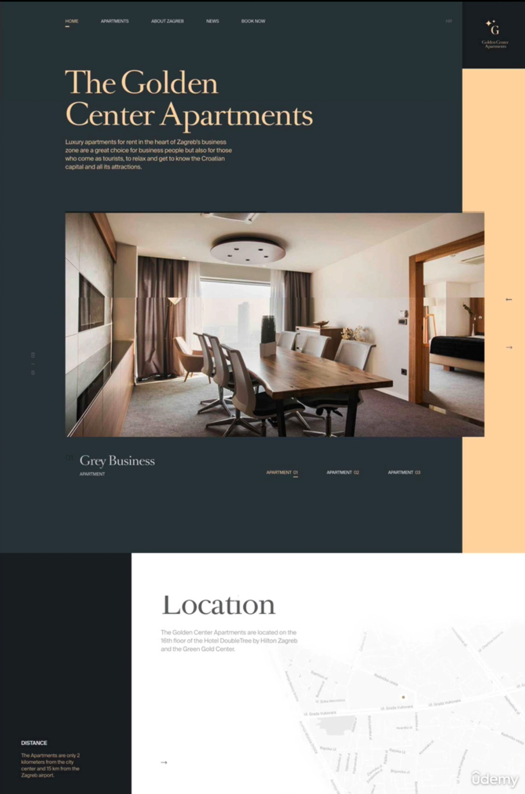
  <figcaption>Serious/Elegant Website Personalities.</figcaption>
</figure>

2. **Minimalist/Simple**: Focusses on the essential text content, using small or medium-sized sans-serif black text, lines, and few images and icons.
<figure>
  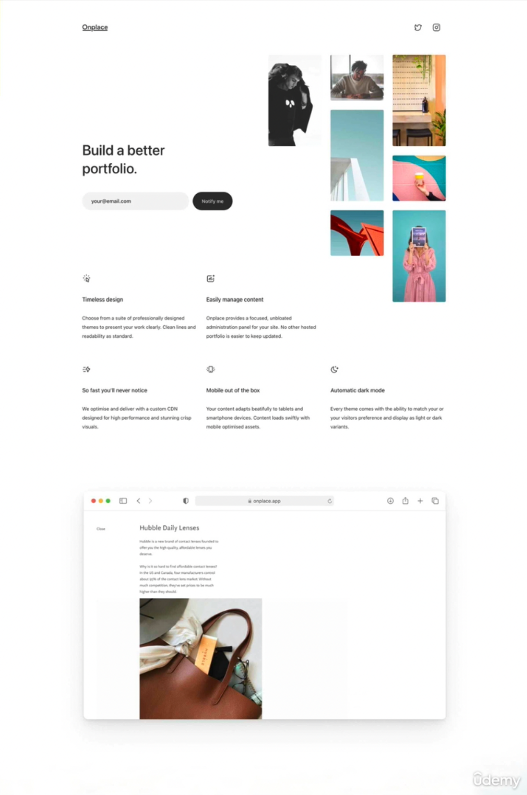
  <figcaption>Minimalist/Simple Website Personalities.</figcaption>
</figure>

3. **Plain/Neutral**: Design that gets out of the way by using neutral and small typefaces, and a very structured layout.
<figure>
  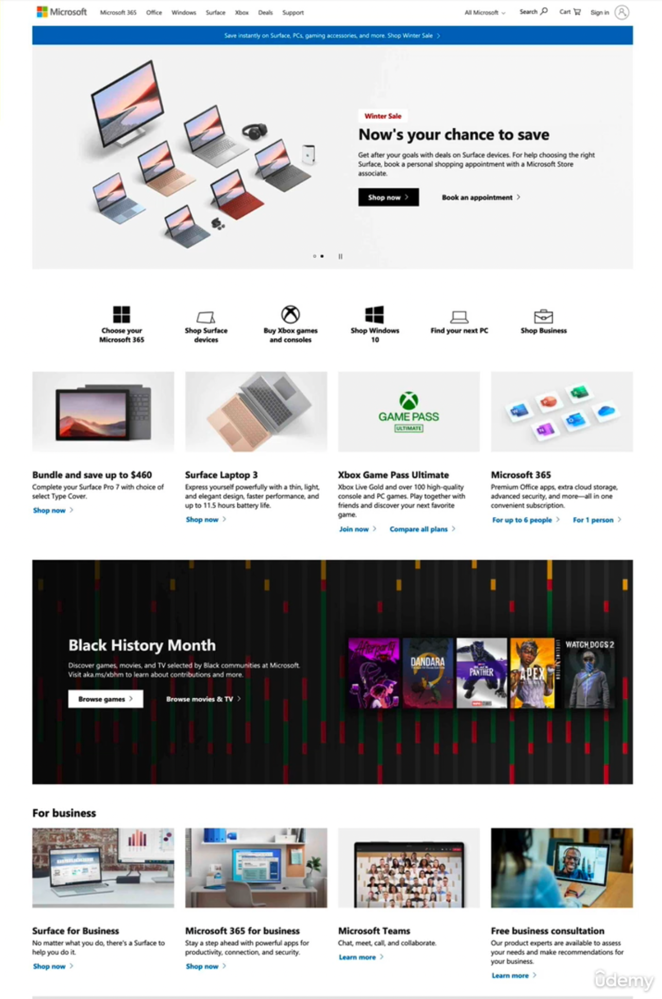
  <figcaption>Plain/Neutral Website Personalities.</figcaption>
</figure>

4. **Bold/Confident**: Makes an impact, by featuring big and bold typography, paired with confident use of big and bright colored books.
<figure>
  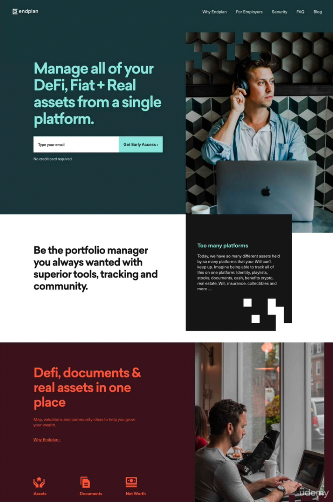
  <figcaption>Bold/Confident Website Personalities.</figcaption>
</figure>

5. **Clam/Peaceful**: For products and services that care, transmitted by calming pastel colors, soft serif headings, and matching imaged/illustrations.
<figure>
  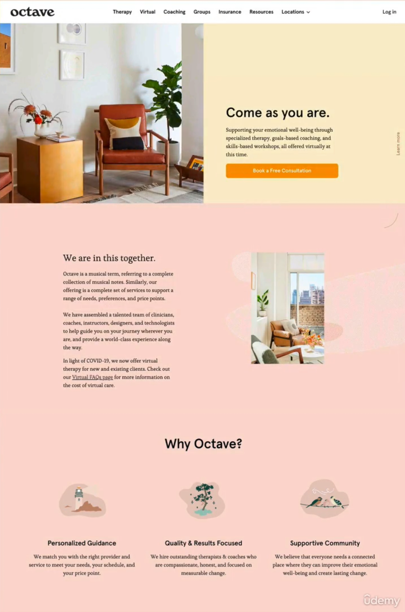
  <figcaption>Clam/Peaceful Website Personalities.</figcaption>
</figure>

6. **Startup/Upbeat**: Widely used in startups, featuring medium-sized sans-serif typefaces, light-grey text and backgrounds, and rounded elements.
<figure>
  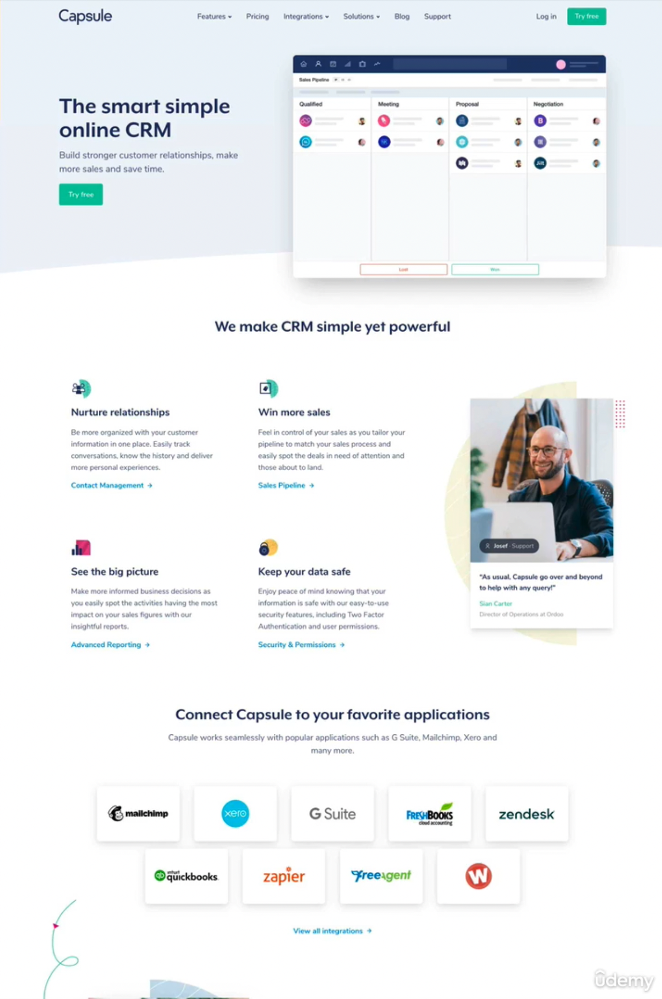
  <figcaption>Startup/Upbeat Website Personalities.</figcaption>
</figure>

7. **Playful/Fun**: Colorful and round designs, fueled by creative elements like hand-drawn icons or illustrations, animations and fun language.
<figure>
  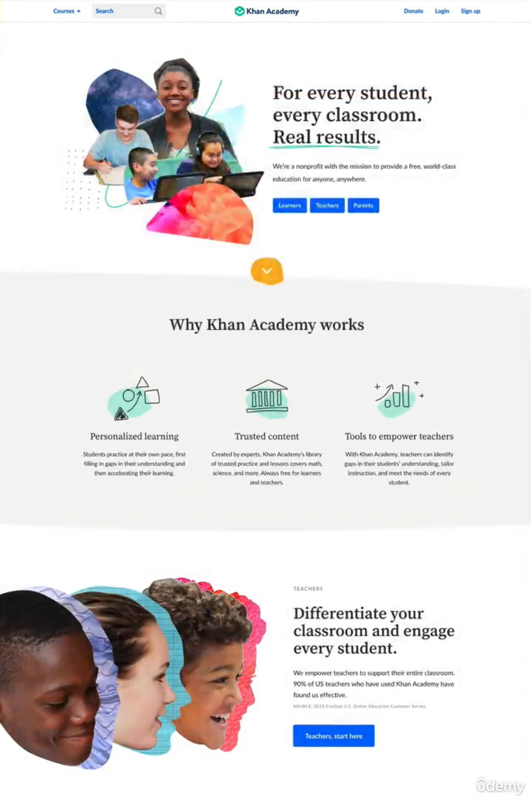
  <figcaption>Playful/Fun Website Personalities.</figcaption>
</figure>
